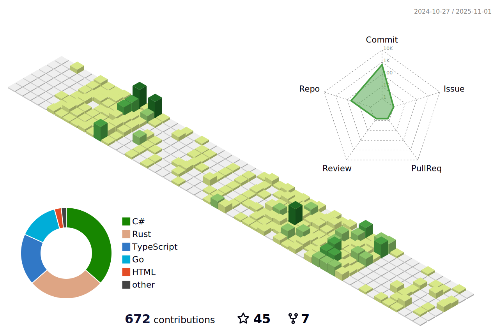

[//]: # (<picture>)

[//]: # (  <source media="&#40;prefers-color-scheme: dark&#41;" srcset="https://raw.githubusercontent.com/duyl328/duyl328/output/github-contribution-grid-snake-dark.svg">)

[//]: # (  <source media="&#40;prefers-color-scheme: light&#41;" srcset="https://raw.githubusercontent.com/duyl328/duyl328/output/github-contribution-grid-snake.svg">)

[//]: # (  )

[//]: # (</picture>)

